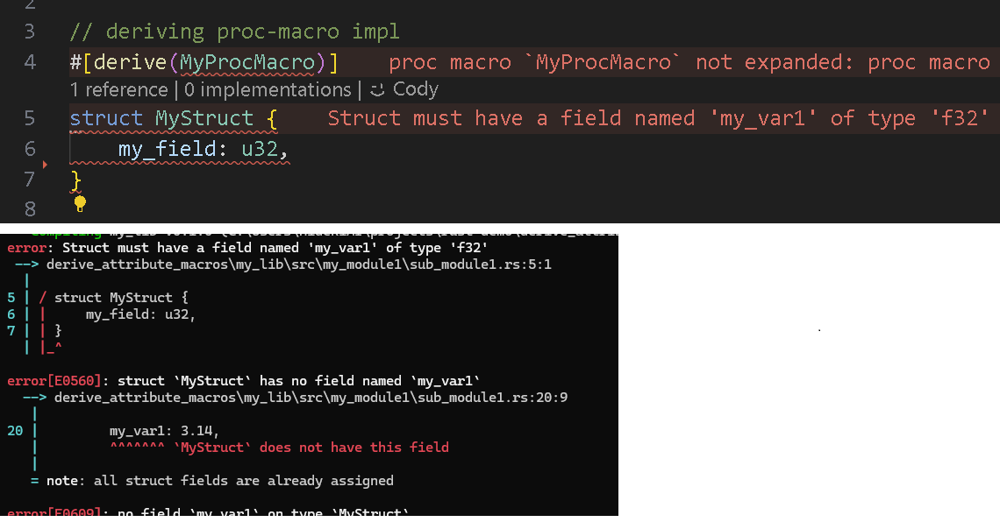

# Sample boilerplate of libs with and without proc-macro

"proc-macro" stands for [Procedural Macros](https://doc.rust-lang.org/reference/procedural-macros.html).  There is another kind of macros called [Macros By Example (MBE)](https://doc.rust-lang.org/reference/macros-by-example.html) but IMHO I do not mean to write lexical-analyzer desciplining the coder to follow the syntax I want (at least for now), so I will stick to the proc-macro for this demo.

Procedural macros are treated during compile time.  As a dotnet/.net developer, when you see these kind of syntax, it reminds us of something similar to [`[Attributes]`](https://learn.microsoft.com/en-us/dotnet/csharp/advanced-topics/reflection-and-attributes/) declarations, in which, it will make it harder to grasp the differences between code/compile-time and runtime.  Only similarities IMHO is  that when you write your own `[Attribute]` in C# (I've never written on in F#, but I think that should be one of the things I'd like to add to my checklist of "I've done it once" :grin: ) and proc-macro is that they both end up as an individual crate (or DLL) in which you'd link against and inherit its characteristics without coding anything.  Other than than, proco-macros are more complex compared to dotnet `[Attribute]`, and that dotnet is runtime reflection (for example, you write an app in which you give it a plug-in feature, that needs to inspect during runtime whether that DLL can be plugged in or not) in which you'd link against it and cross your finger during run-time (or unit-test time).

Procedural macros are useful for:

- auto generating code via derivations (i.e. `Debug` and `PartialEq`, etc - see [here](https://github.com/rust-lang/rust/blob/master/compiler/rustc_builtin_macros/src/lib.rs#L116)).  All in all, if you come from C{urly} languages (C|C++|C#), mainly languages that handles OOP to inherit (derive) "something", then sooner or later, you want to write a library that will inherit attributes (as mentioned above, most similar to dotnet `[Attribute]`).
- annotating behavior of the code during runtime (including test):
  - in code block such as `if cfg!(feature="my_feature") {...}`
  - in unit-test such as `#[test_case(-1, -42; "both are negative")] fn test_negative(l: i32, r: i32) {...}` in which `cargo test` will run the test.
- the standard "macros" we're used to from other languages (i.e. `println!`, `format!`, etc) known as [Function-Like Procedural Macros](https://doc.rust-lang.org/reference/procedural-macros.html#function-like-procedural-macros) (also see C/C++ [Function-Like macros](https://gcc.gnu.org/onlinedocs/cpp/Function-like-Macros.html)); note that the syntax is similar to MBE, so I've written one, but probably will not write one unless I really really need it.

All in all, one have to constantly remind ourselves that Rust is a compile-time language, and that the proc-macro is a compile-time feature.  Hence it is a bit more complicated compared to C/C++ "Function-Like Macros", but if you (like myself) have more than once declared "I'll NEVER USE MACROS EVER AGAIN!" after finding that hard-to-find RUNTIME bug/error in C++, just remember, it's not that kind of macros...  If you've written Rust for at least few weeks, you've already have appreciated the `#[derive(Debug)]`, or have seen compiliers complain (again, I want to emphasize, NOT RUNTIME) that you should add `Clone` but you don't need to `impl` the cloning logic because your `struct` is made off of all primitives (P.o.D), you're already using them and have appreciated how useful they are.

Directory structure will look like so:

```cargo
my_workspace/
├── Cargo.toml
├── my_lib/
│   ├── Cargo.toml
│   └── src/
│       ├── lib.rs
│       ├── main.rs (optional)
│       ├── my_module1/
│       │   ├── mod.rs
│       │   └── sub_module1.rs
│       └── ...
└── my_macros/
    ├── Cargo.toml
    └── src/
        ├── lib.rs
        ├── my_module2/
        │   ├── mod.rs
        │   └── sub_module2.rs
        └── ...
```

- because you CANNOT share proc-macro sub-modules with other sub-modules, you must create a separate crate for your macros
- the "my_lib" is the crate (with its own Cargo.toml) that will not declare proc-macro related modules
- the "my_macros" is the crate (with its own Cargo.toml) that will declare proc-macro related modules (in mod.rs)

Remember, you *must* declare `proc-macro = true` in Cargo.toml as a crate (per crate).  Per-crate, because if you do not declare `#[proc_macro]` at the "root" level of crates, though you can define multiple `pub fn`s in the same crate, as long as they are all at the "root" of the crate.

## Usage

I think it's more comprehensive if we start with the intents from the user's point of view before we show the logic on the actual derivable procedural macro which will parse and even tell you issues during static analysis and compile time.

```rust

// deriving proc-macro impl
#[derive(MyProcMacro)]
struct MyStruct {
    my_field: u32,
}
```



By deriving `MyProcMacro`, the compiler will complain that you are missing the field `my_var1` in the struct.  The message you will read is actually the constant string which you have added in the proc-macro crate to make your derivable library useful...

You can just follow the missing variable with expected type (`i32` with varname `my_var1`) but the parser will also validate that it is of `i32` type, but if you change it to `f32` or something else, you'll also get an error.

Once again, this is the beauty of compile-time errors and static-analysis as you code rather than during the runtime you'd get a "null exception" because your virtual table is missing something...

## Your useful macros

There are two kinds of proc-macros in this writeup:
- `MyProcMacro` - this is the derive'able proc-macro in which it'll check/test your struct to make sure it has a variable of expected type and also embed (inherit) a function
- `make_answer()` - this just inserts a RAW STRING as if, traditionally done in C|C++ macros (well, C compiler, if I remember, replaces embedds macros on first pass and then compiles on 2nd pass as if that macro was actually hand-coded)

### MyProcMacro

```rust
// Purpose of this macro:
// verifies that the struct has a field named `my_var1` of type `f32`
// and then generates a method to halve `my_var1` as `half_my_var1` in which
// the caller can assume that they will inherit that function without impl it themselves
#[proc_macro_derive(MyProcMacro)]
pub fn my_proc_macro_fn(input: TokenStream) -> TokenStream {
    // Parse the input tokens into a syntax tree
    let input = parse_macro_input!(input as DeriveInput);

    // Check if the struct has a field named "my_var1" of type "f32"
    let my_var1_exists = match input.data {
        syn::Data::Struct(ref data) => data.fields.iter().any(|field| {
            field
                .ident
                .as_ref()
                .map_or(false, |ident| ident == "my_var1")
                && matches!(&field.ty, syn::Type::Path(p) if p.path.is_ident("f32"))
        }),
        _ => false,
    };

    if !my_var1_exists {
        // Emit a helpful compiler error
        return syn::Error::new_spanned(
            &input,
            "Struct must have a field named 'my_var1' of type 'f32'",
        )
        .to_compile_error()
        .into();
    }

    // Ensure that the struct has a field named `my_var1` of type `f32`
    let my_var1_type = quote! { f32 };
    let struct_name = &input.ident;

    // Generate the code to halve `my_var1`
    let expanded = quote! {
        impl #struct_name {
            pub fn half_my_var1(&mut self) {
                self.my_var1 /= 2.0;
            }
        }
    };

    // Hand the output tokens back to the compiler
    TokenStream::from(expanded)
}
```

Just few notes:

- I am using `syn` and `quote` crate, mainly because my life is happier this way
- the parser will look for expected variable-field with expected type, and if not, it'll display your custom (hopefully meaningful) message to help the user
- the logic also adds a function `half_my_var()` to your struct (`#struct_name`), in this example, it is a `pub` function, but of course, it can be anything you want.  Nice thing about this method is that I get the compiler to verify for me whether the function I am embedding to your struct is valid syntatctically. (see my example on `make_answer()` macro injector below)

### make_answer

And here's another example that sort of resembles the C|C++ macro:

```rust
// Example usage:
//      extern crate proc_macro_examples;
//      use proc_macro_examples::make_answer;
//
//      make_answer!();
//
//      fn main() {
//          println!("{}", answer());
//      }
#[proc_macro]
pub fn make_answer(_item: TokenStream) -> TokenStream {
    // just like traditional C/C++ macro, a "macro" in this case
    // will place this string IN PLACE of the macro call as
    // a function "fn answer()"
    "fn answer() -> u32 { 42 }".parse().unwrap()
}
```

Well, just read the comments...

## Usage

``` rust
// calling proc-macro directly
pub(crate) fn do_something() {
    my_macro1!();
    // construct a 'fn answer()' function:
    make_answer!();
    println!("The answer is: {}", answer());

    // the MyProcMacro should have a method 'half_my_var1' that halves the value of 'my_var1'
    // first, dump my_var1 to verify its value
    let mut my_struct = MyStruct {
        my_field: 42,
        my_var1: 3.14,
    };
    println!("my_var1: {}", my_struct.my_var1);
    // then, call the method to halve my_var1
    my_struct.half_my_var1();
    println!("half_my_var1: {:?}", my_struct.my_var1);
}
```

And the output:

``` bash
The answer is: 42
my_var1: 3.14
half_my_var1: 1.57
```